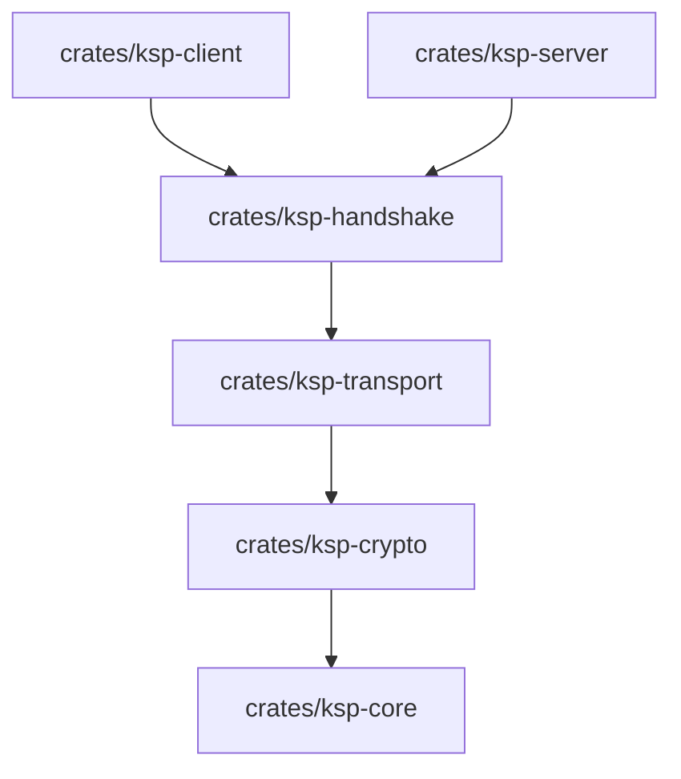
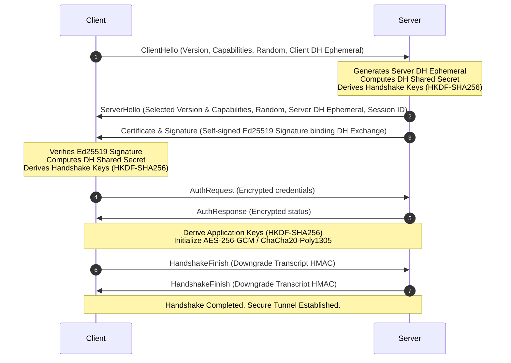

# Architecture & Design of Kush Secure Protocol (KSP)

This document provides a technical deep-dive into the architectural layout, crate design, cryptographic flow, and internal mechanics of the **Kush Secure Protocol (KSP)** implementation.

---

## 🏗️ Crate Topology

KSP is organized as a cargo workspace with highly modular, isolated crates. This limits compile boundaries and prevents implementation details from leaking across boundaries.

### Crate Responsibilities

1. **`ksp-core` (Binary Serialization)**
   * Parses and serializes the 48-byte binary header and payload segments.
   * Leverages `bytes::BytesMut` for zero-copy parsing.
   * Maps wire format limits (e.g., maximum packet size checks to prevent allocation OOM).

2. **`ksp-crypto` (Primitives)**
   * Manages symmetric and asymmetric cryptography wrapper implementations.
   * Cryptographic Stack:
     * Key Exchange: Ephemeral `X25519` via `x25519-dalek`.
     * Identity Signatures: `Ed25519` via `ed25519-dalek`.
     * Key Derivation: `HKDF-SHA256` via `hkdf` / `sha2`.
     * AEAD Encryption: `AES-256-GCM` (`aes-gcm`) and `ChaCha20-Poly1305` (`chacha20poly1305`).
   * Implements secure zeroization (`Zeroize` trait) for private keys and ephemeral values upon drop.

3. **`ksp-handshake` (State Machine)**
   * Implements a strongly-typed, unidirectional handshake state machine.
   * Ensures that key derivation cannot be executed until cryptographic parameters are successfully bound and authenticated.

4. **`ksp-transport` (Session State & Replay Protection)**
   * Implements connection metrics: keepalive frames, sequence tracking, and stream multiplexing.
   * Mitigates packet replay attacks via a 1024-packet sliding window bitmask.

5. **`ksp-client` & `ksp-server` (High-Level Connection Loops)**
   * Integrates the network listener loops, managing incoming TCP socket framing and exposing an asynchronous, stream-oriented API (`KspClient` / `KspServer`).

---

## 🔒 Cryptographic Handshake Sequence

The KSP handshake validates protocol versions, negotiates features (compression, encryption algorithms), performs DH key exchange, and binds parameters via a signature to prevent MITM attacks.

---

## ⚡ Safety & Hardening Principles

* **Zeroization**: Raw private keys and derived KDF session blocks implement `ZeroizeOnDrop` or invoke `zeroize()` on destruction. This prevents information disclosure through memory dumps.
* **Counter-based Nonces**: AEAD nonces are computed via a base initialization vector (IV) XORed with the packet sequence number. Since sequence numbers are monotonically increasing, nonce reuse is mathematically impossible.
* **Strict Allocation Checking**: When decoding packets, the buffer allocation size is limited by the protocol's maximum bounds (16MB). A malicious node declaring a `4GB` payload will be disconnected before allocating heap memory.
