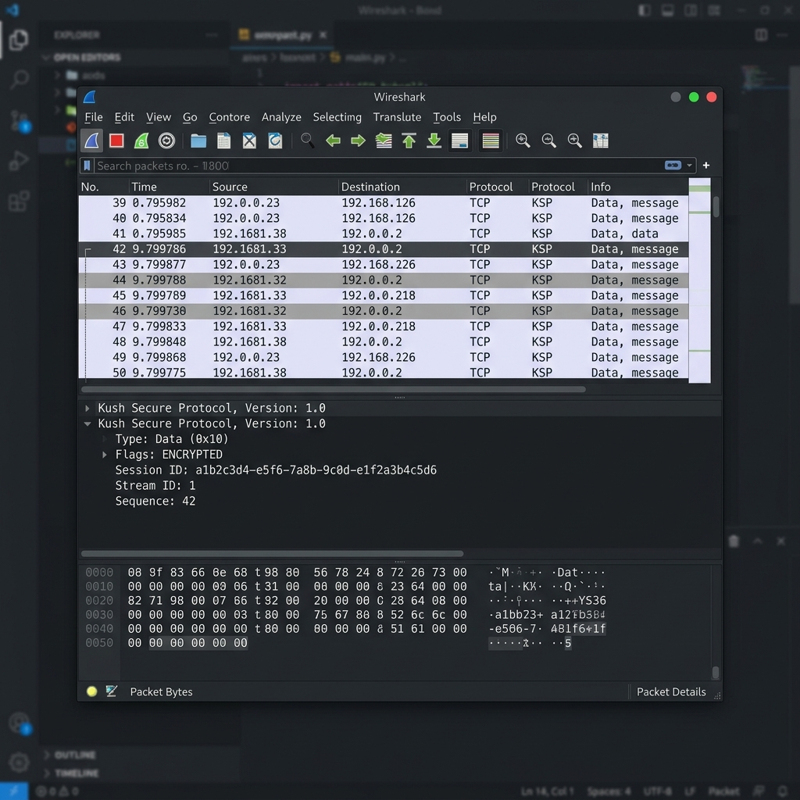
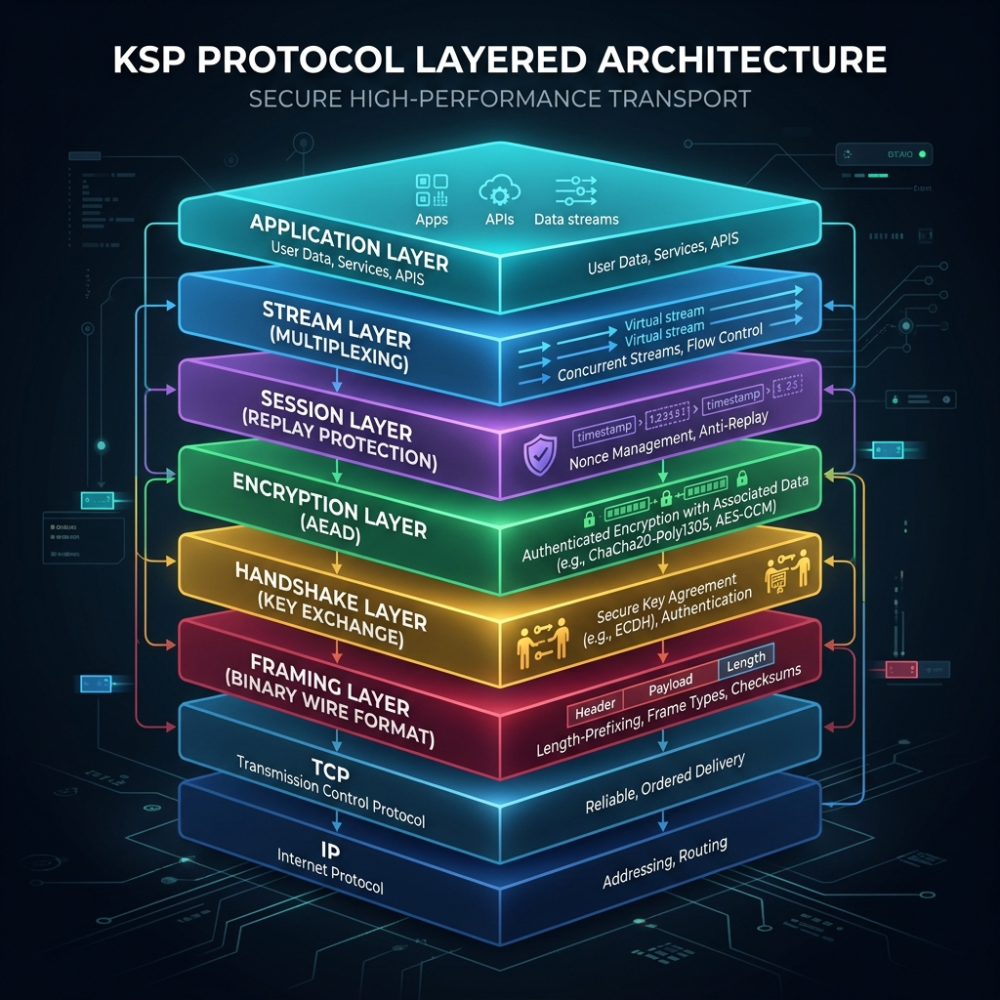
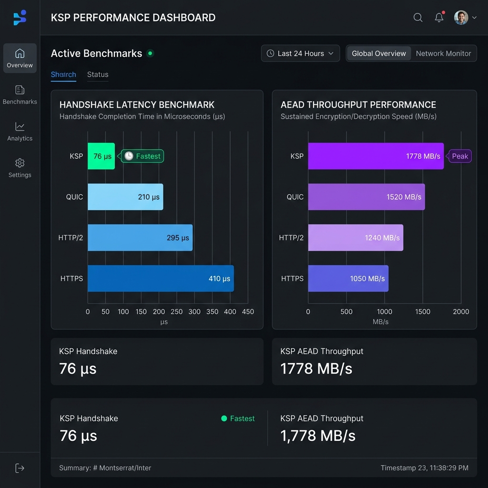
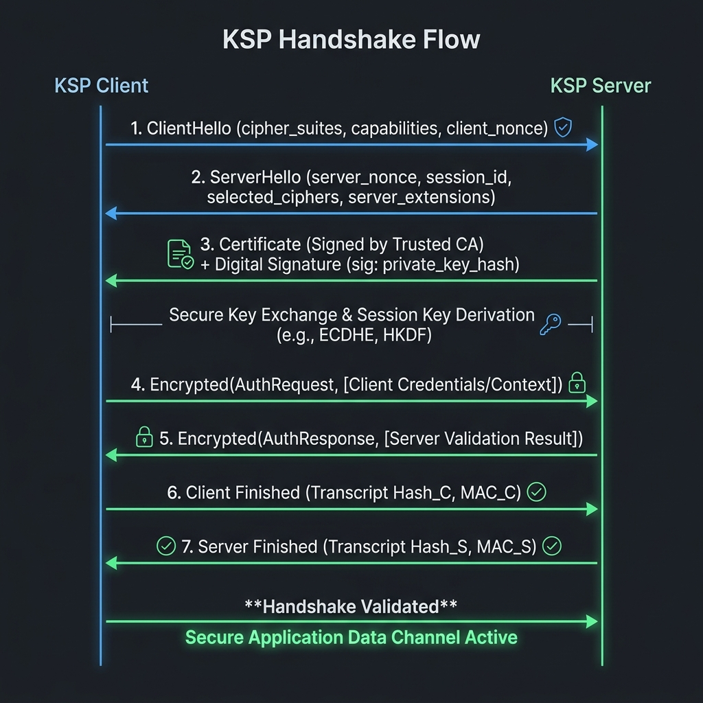
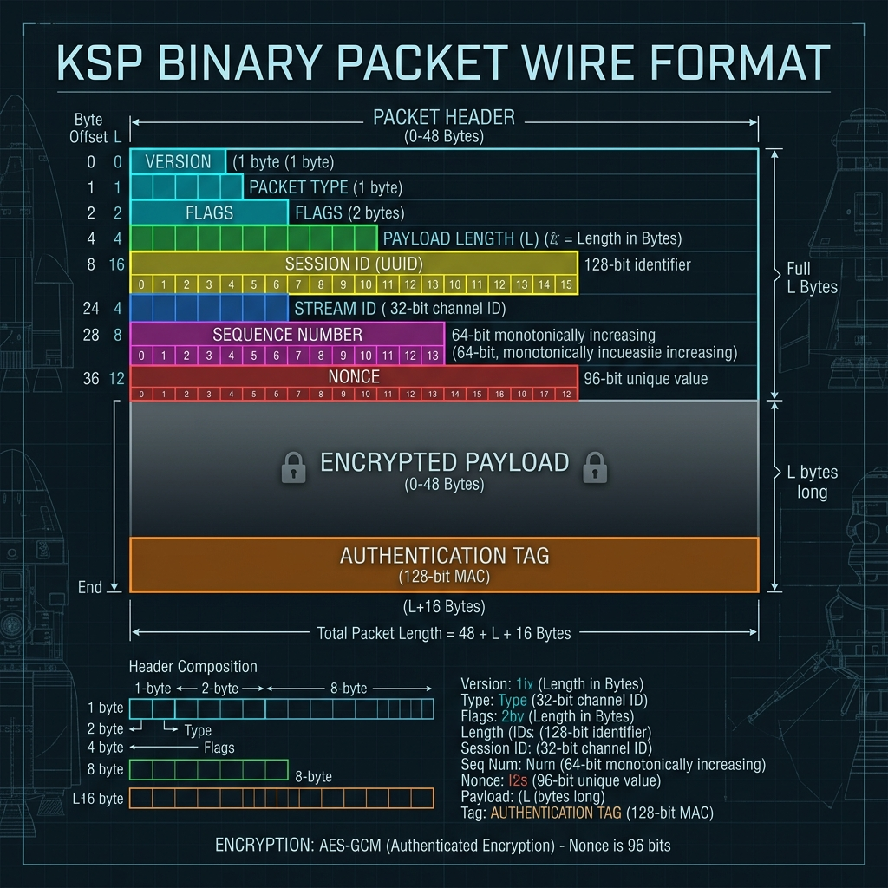

# 🔐 KSP (Kush Secure Protocol)

<div align="center">

### 🌐 **[Official Website & Interactive Showcase: www.kspprotocol.dev](https://www.kspprotocol.dev)**

[](https://www.kspprotocol.dev)
[](https://www.kspprotocol.dev)
[](https://www.kspprotocol.dev)

<br />

**An Experimental, Cryptographically Hardened Application-Layer Protocol Built in Rust**

[](https://github.com/kush/ksp/actions)
[](https://crates.io)
[](https://docs.rs/ksp)
[](LICENSE)
[](https://www.rust-lang.org)
[](SECURITY.md)

[🌐 Official Website](https://www.kspprotocol.dev) · [RFC Specification](spec/RFC-0001-ksp-v1.md) · [Performance Benchmarks](docs/benchmarks.md) · [Engineering Review](docs/comprehensive_review.md) · [Wireshark Dissector](wireshark-plugin/ksp.lua)

---

</div>

> [!TIP]
> **🌟 Experience KSP Live**: Visit **[kspprotocol.dev](https://www.kspprotocol.dev)** to try out our **Interactive Packet Dissector**, step through the **Cryptographic Handshake State Machine** in real-time, explore **Criterion Benchmark comparisons**, and inspect live architectural diagrams directly in your browser!

> [!IMPORTANT]
> **Project Context**: KSP is an experimental application-layer protocol written in Rust to explore protocol engineering, authenticated key exchange, replay protection, binary serialization, and secure client-server communication. It is intended as a learning and research project rather than a replacement for HTTP/HTTPS.

---

## 💡 Protocol Motivation & Design

Traditional protocols like HTTPS (HTTP/2 or HTTP/3 over TLS 1.3/QUIC) are highly complete and battle-tested webservices. However, their reliance on extensive historical features (X.509 certificate chains, ALPN negotiation, massive cipher suites, backward-compatibility hooks, and complex text parsers) introduces substantial implementation complexity and computational overhead.

**KSP (Kush Secure Protocol)** explores an alternative design optimized for application-specific communication. It implements a lightweight protocol architecture that isolates transport, session state, AEAD encryption, and handshakes into decoupled modular components.

### Core Visuals & Dissection

<div align="center">


*Figure 1: Custom KSP Dissector decoding Version, Type, Session ID, Stream ID, and payload fields.*

</div>

---

## 🏗️ Layered Architecture

KSP isolates distinct protocol responsibilities into a structured crate stack:

<div align="center">



</div>

* 📂 `ksp-core`: Packet binary serialization/deserialization and error boundary mapping.
* 📂 `ksp-crypto`: Ephemeral X25519 Diffie-Hellman, HKDF-SHA256, and AEAD (AES-256-GCM / ChaCha20-Poly1305).
* 📂 `ksp-handshake`: Type-driven handshake state machine and message processing.
* 📂 `ksp-transport`: Replay window bitmaps, streams, keepalives, and window-based flow control.

---

## ⚡ Performance Scorecard & Benchmarks

The Criterion benchmark suite was executed on the host system to capture baseline performance characteristics:

### Test Environment
* **CPU**: 13th Gen Intel(R) Core(TM) i7-13650HX
* **OS**: Windows 11 Home (Build 22631)
* **Rust version**: v1.96.1 (stable-x86_64-pc-windows-msvc)
* **Mode**: Release Mode (`--release`)
* **Benchmarking Harness**: Criterion 0.5.1

### Performance Benchmarks

| Operation / Metric | KSP Performance | Notes / Details |
|:---|:---|:---|
| **Handshake Setup Latency** | **`76.0 µs`** (0.076 ms) | Ephemeral X25519 key derivation + key exchange + HKDF-SHA256 derivation |
| **1 KB Serialization** | **`41.4 ns`** | Header layout and big-endian binary encoding |
| **1 KB Deserialization** | **`65.9 ns`** | Fixed-header parsing and length boundary checks |
| **AES-256-GCM Throughput** | **`1,778 MB/s`** | Single-core decryption throughput (64 KB payloads) |
| **ChaCha20-Poly1305 Throughput** | **`1,316 MB/s`** | Single-core encryption throughput (64 KB payloads) |

<div align="center">


*Figure 2: Performance throughput bar chart compared to software fallbacks.*

</div>

---

## 📜 Cryptographic Handshake Flow

KSP performs version negotiation, capability intersection, and verifies identity by signing key exchanges to prevent Man-in-the-Middle (MITM) attacks:

<div align="center">



</div>

1. **ClientHello**: Version proposal, capability bitfield, client random, client X25519 public key.
2. **ServerHello**: Selected version, selected capabilities, server random, server X25519 public key, UUID session ID.
3. **Certificate**: Serialized self-signed certificate, along with a 64-byte Ed25519 signature computed over all handshake parameter inputs to cryptographically bind the exchange.
4. **AuthRequest / AuthResponse**: Credentials verification encrypted under derived keys.
5. **HandshakeFinish**: Downgrade protection transcript HMAC checking.

---

## 📦 Packet Binary Layout

KSP uses a compact 48-byte fixed binary header (network byte order) to minimize serialization overhead and prevent memory-based allocation Denial of Service (DoS):

<div align="center">



</div>

---

## 🛡️ Threat Model & Security Mitigations

| Threat Vector | Potential Impact | KSP Mitigation Strategy |
|:---|:---|:---|
| **Man-in-the-Middle (MITM)** | Attacker intercepts ephemeral keys and injects a fake key. | **Key-Exchange Binding**: The server signs the client/server randoms and X25519 public keys with its certificate. The client verifies this signature before key derivation. |
| **Downgrade Attack** | Attacker intercepts ClientHello to force a weaker version or cipher. | **Transcript HMAC**: At handshake finalization, both parties verify `HandshakeFinish` HMACs computed over the complete transcript of negotiated parameters. |
| **Replay Attacks** | Attacker intercepts and replays valid packets to duplicate commands. | **Sliding-Window Bitmaps**: 1024-packet sliding verification window in both directions rejects duplicate sequence numbers immediately. |
| **Nonce Reuse** | Nonce exhaustion or collisions leak AEAD key details. | **Deterministic Counter Nonce**: Handshake derives a base IV. Packets use `IV XOR sequence_number` as the nonce, guaranteeing uniqueness. |
| **Memory Exhaustion (DoS)** | Malformed packet lists a massive payload length, causing instant memory OOM. | **Strict Length Enforcements**: Packet parsing validates that the payload length is within `MAX_PAYLOAD_SIZE` (16MB) before allocating heap vectors. |
| **Private Key Leakage** | Memory dumps or error logging prints private keys or session parameters. | **Secure Zeroization**: Raw ephemeral keys and derived session secrets implement the `Zeroize` trait, wiping memory upon scope drop. Custom `Debug` implementations redact key bytes from logs. |

---

## 🛠️ API Example

Using the high-level connection abstractions inside the library is straightforward:

```rust
use ksp_client::KspClient;
use ksp_core::capability::Capabilities;

#[tokio::main]
async fn main() -> Result<(), Box<dyn std::error::Error>> {
    // Connect to the server and execute handshake
    let mut client = KspClient::connect("127.0.0.1:9876").await?;
    println!("Session established! Session ID: {}", client.session_id());

    // Send application data over stream ID 1
    client.send(1, b"Hello, secure KSP server!").await?;

    // Receive responses
    let response = client.receive(1).await?;
    println!("Received: {:?}", String::from_utf8_lossy(&response));

    Ok(())
}
```

---

## 🚀 Quick Start

### Option A: Running Locally
1. Clone the repository and build:
   ```bash
   git clone https://github.com/kush/ksp.git
   cd ksp
   cargo build --workspace
   ```
2. Start the server (auto-generates certificates):
   ```bash
   cargo run --bin ksp-server
   ```
3. Run the client:
   ```bash
   cargo run --bin ksp-client
   ```

### Option B: Running with Docker
Build and launch the complete client-server topology in isolated container networks using Docker Compose:
```bash
docker compose up --build
```

---

## 🗺️ Project Roadmap

- [x] **Phase 1**: Core crates implementation (Core, Crypto, Handshake, Transport)
- [x] **Phase 2**: Asynchronous server/client loops
- [x] **Phase 3**: Sliding-window replay protection and cryptographic bindings
- [x] **Phase 4**: Criterion-based benchmarks and Wireshark Lua plugin integration
- [x] **Phase 5**: Docker containerization & quick-start templates
- [ ] **Phase 6**: Fuzz testing harness (`cargo-fuzz`)
- [ ] **Phase 7**: CLI helper tool (`ksp-cli`)
- [ ] **Phase 8**: Post-quantum hybrid key exchange integration (ML-KEM + X25519)
- [ ] **Phase 9**: Detailed RFC publication and integration whitepaper
